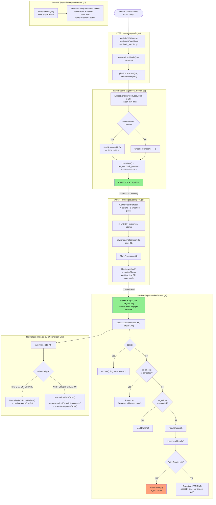

# Reliable Partitioned Webhook Ingestion — Diagram & Review

## Code Flow Diagram



---

## Genuine Code Review

### ✅ What's Working Well

| Area | File(s) | Assessment |
|------|---------|------------|
| **Outbox pattern** | `webhook_method.go`, `save_raw_method.go` | Solid. `SaveRaw` runs before 202 is returned — durability guaranteed |
| **gjson fast extraction** | `extractor.go` | Correct use of `gjson.ValidBytes` + `GetBytes`. Zero-allocation path |
| **FNV-1a partitioning** | `partition.go` | Deterministic, fast, correct sign-masking with `& 0x7fffffff` |
| **Unsorted lane** | `pool.go` | Good fallback. Sentinel value `-1` is clean |
| **Panic recovery in worker** | `worker.go:36-44` | Correctly wraps `targetFunc` in an anonymous func for deferred recovery |
| **Context timeout handling** | `worker.go:47-50` | Correctly detects `context.DeadlineExceeded` and lets sweeper handle it |
| **Sweeper** | `sweeper.go` | Simple, correct, context-aware |
| **Graceful shutdown** | `main.go:114-124` | Proper order: stop HTTP → cancel pollers → `pool.Stop()` |
| **Hardcoded `VendorOrderIDPath`** | `webhook_handler.go:31,60` | Works but is a config smell (see issues) |

---

### 🔴 Critical Bugs

#### ~~1. Worker channels are never consumed — **workers are dead letters**~~ ✅ FIXED

**File:** `pool/pool.go` + `worker/worker.go`

Added `Worker.Run(ctx, ch, targetFunc)` — a select-loop that drains its channel and calls `processWebhook` for each item. `pool.Start()` now launches one consumer goroutine per partition channel and one for the unsorted channel.

```go
// worker.go — new exported Run loop
func (w *Worker) Run(ctx context.Context, ch <-chan *domain.RawWebhook, targetFunc ...) {
    for {
        select {
        case <-ctx.Done(): return
        case wh, ok := <-ch:
            if !ok { return }
            w.processWebhook(ctx, wh, targetFunc)
        }
    }
}

// pool.go Start() — consumer goroutine per worker
for i := 0; i < p.cfg.N; i++ {
    w, ch := p.workers[i], p.workerChans[i]
    p.wg.Add(1)
    go func() { defer p.wg.Done(); w.Run(ctx, ch, p.targetFunc) }()
}
// + one for unsortedCh
```

---

#### ~~2. Race condition in `handleFailure` — off-by-one retry logic~~ ✅ FIXED

**File:** `worker/worker.go:60-72`

The user fixed this by checking the retry count *before* it is incremented.

```go
if wh.RetryCount+1 >= maxRetries {
    w.repo.MarkFailed(ctx, wh.ID)
    logger.Error(ctx, "max retries exceeded, moving to DLQ", nil, "id", wh.ID)
    return nil
}
w.repo.IncrementRetry(ctx, wh.ID)
```

---

#### 3. `UpdateStatus` is a stub — silent no-op

**File:** `data/sql/webhook/save_raw_method.go:41-43`

```go
func (repo *SQLWebhookRepository) UpdateStatus(...) error {
    return nil  // ❌ unimplemented
}
```

This is in the `WebhookRepository` interface and could be called by external code. Silently succeeds = silent data corruption if anything relies on it.

---

#### 4. `readAndLimitBody` passes `nil` to `MaxBytesReader`

**File:** `webhook_handler.go:76`

```go
r.Body = http.MaxBytesReader(nil, r.Body, maxBodyBytes)
//                           ^^^^ should be `w` (http.ResponseWriter)
```

`MaxBytesReader` needs the `ResponseWriter` to send a proper 413 response when the limit is hit. With `nil`, it will panic or silently truncate depending on Go version.

---

### 🟡 Significant Issues

#### 5. Partition count hardcoded to `8` in pipeline

**File:** `webhook_method.go:52`

```go
partitionIndex = partition.HashPartition(vendorOrderID, 8) // ❌ magic number
```

The pool's `N` is also `8` (in `main.go`), but these are **separate hardcodes that must be kept in sync manually**. If someone changes pool `N` to 16, outbox rows will be written with `partition_index` values 0-7, and the new pollers for 8-15 will always find nothing.

**Fix:** Pass `N` into `IngestPipeline` at construction time and use `p.N` in `persistRawWebhook`.

---

#### 6. `normalize()` method is dead code

**File:** `webhook_method.go:69-82`

`normalize()`, `normalizeDISStatusUpdate()`, and `normalizeWMSOrderCreation()` exist on `IngestPipeline` but are **never called**. The actual normalization happens inside `buildNormalizerFunc` in `main.go`, not here. The TODO comments confirm this is a leftover.

This creates confusion — a reader assumes the pipeline runs normalization, but it doesn't.

---

#### 7. Sweeper uses its own `interval` as the stuck threshold

**File:** `sweeper.go:34-44`

```go
// main.go
jobSweeper := sweeper.NewSweeper(store.Webhooks, 10*time.Minute)

// sweeper.go
recovered, err := s.repo.RecoverStuck(ctx, s.interval) // same value used for threshold
```

The PRD says stuck threshold is 10 minutes. The sweeper tick interval is also 10 minutes. This means a job stuck for 10 minutes 1 second is recovered at the **next tick** (up to 20 minutes after it got stuck). These should be separate config values (e.g., `interval=1min`, `stuckThreshold=10min`).

---

#### 8. Worker name generation is incorrect

**File:** `pool/pool.go:55`

```go
Name: "worker-" + string(rune(i)),
```

`string(rune(0))` is the null character `\x00`, not `"0"`. For `i=0..7` this produces `"worker-\x00"`, `"worker-\x01"` etc. — invisible characters in logs.

**Fix:** `fmt.Sprintf("worker-%d", i)`

---

### 🟢 Missing PRD Features (Not Yet Implemented)

| PRD Acceptance Criterion | Status |
|--------------------------|--------|
| **Idempotency** — duplicate `VendorWebhookID` ignored | ❌ Not implemented. `SaveRaw` has no UNIQUE constraint check |
| **Observability** — processing lag, retry metrics | ❌ No metrics/tracing (Prometheus, OTEL, etc.) |
| **`RecoverStuck` return value** | ⚠️ Always returns `0, err`. No row-count visibility |
| **DLQ query endpoint** (US4 — Admin view) | ❌ No API to list `is_dlq=true` webhooks |
| **Out-of-order source timestamp check** | ❌ Edge case from PRD not implemented in normalizer |
| **`received_at` not stored** | ⚠️ `SaveRaw` maps `ReceivedAt` in domain struct but the SQL insert doesn't include it |

---

### Summary

The **architecture is sound** — the outbox pattern, partition routing, sweeper, and graceful shutdown are all correctly designed and wired in `main.go`. The painful irony is that the most critical piece — **actually consuming the worker channels** — is missing, which means in production right now, no normalization or order persistence would happen at all. It would just churn through the sweeper loop.

Fix priority order:
1. ✅ ~~Add worker consume loop~~ — `Worker.Run()` added; `pool.Start()` launches consumers
2. ✅ ~~Fix off-by-one retry check (`worker.go`)~~ — Handled via pre-check (`wh.RetryCount+1 >= maxRetries`)
3. 🔴 Fix `MaxBytesReader(nil, ...)` → `MaxBytesReader(w, ...)`
4. 🟡 Pass `N` into `IngestPipeline` (sync partition count)
5. 🟡 Fix worker name string conversion
6. 🟡 Implement `UpdateStatus` or remove from interface
7. 🟢 Add idempotency check in `SaveRaw`
8. 🟢 Separate sweeper interval from stuck threshold
